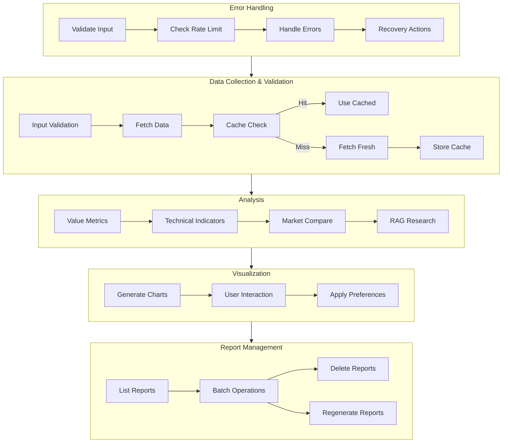
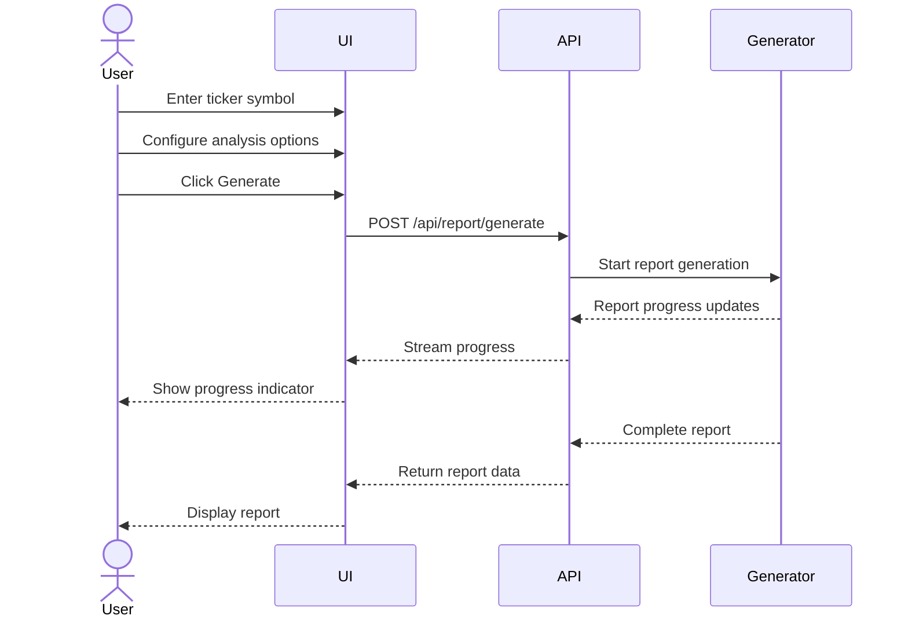
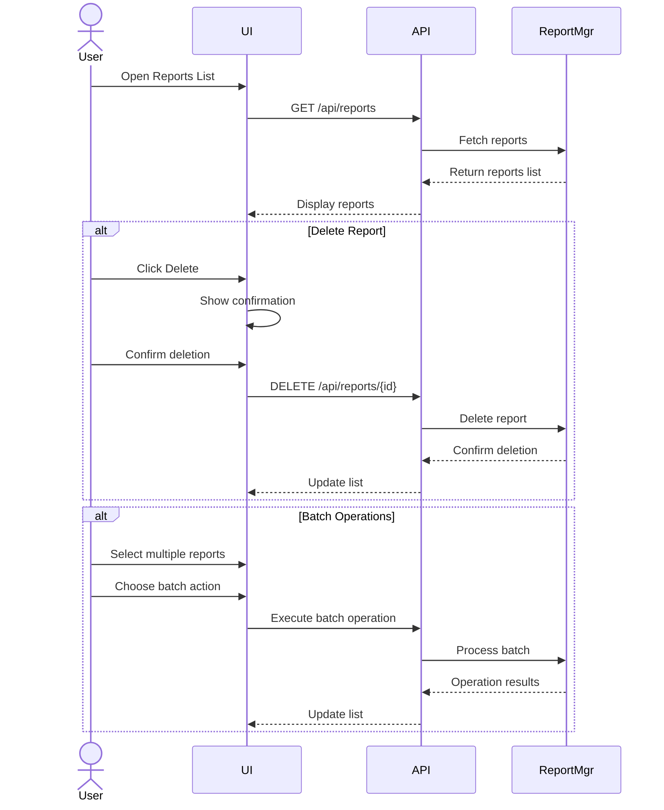
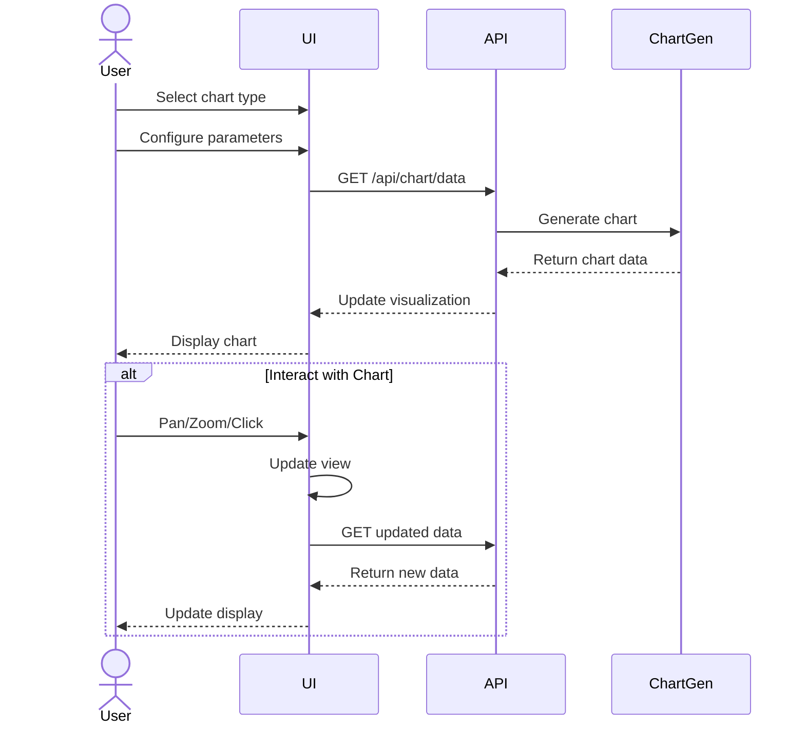
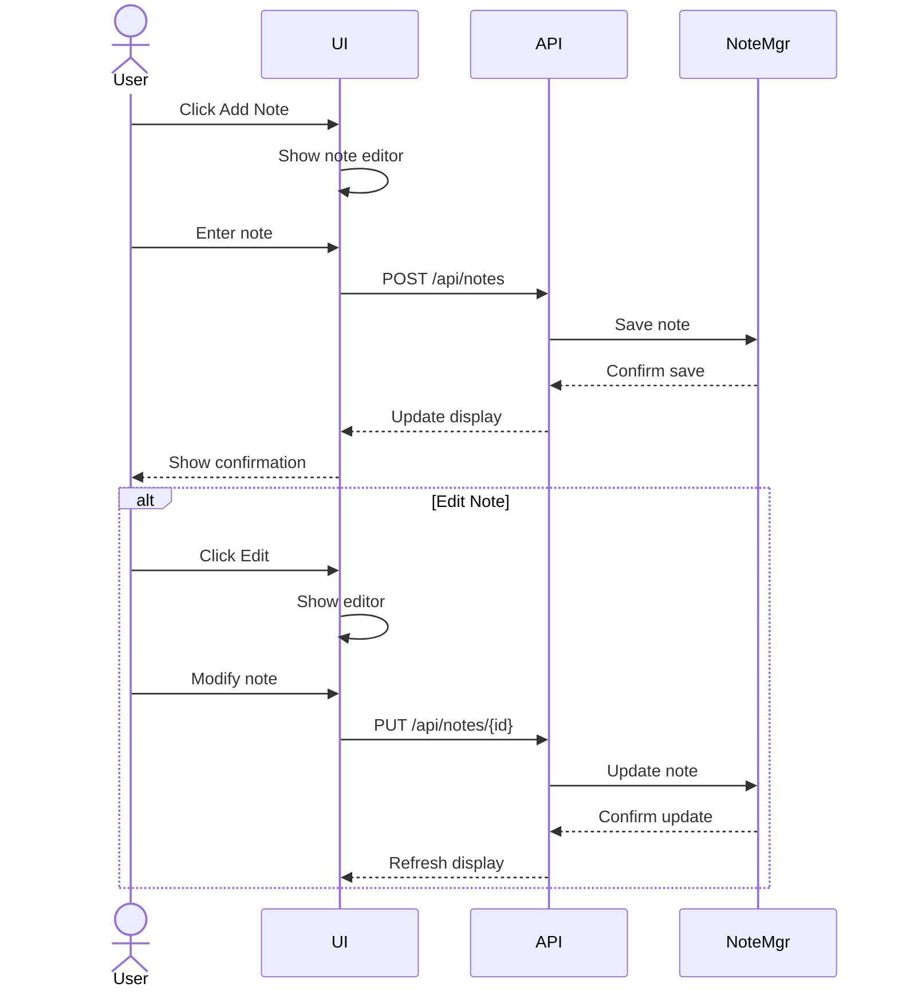
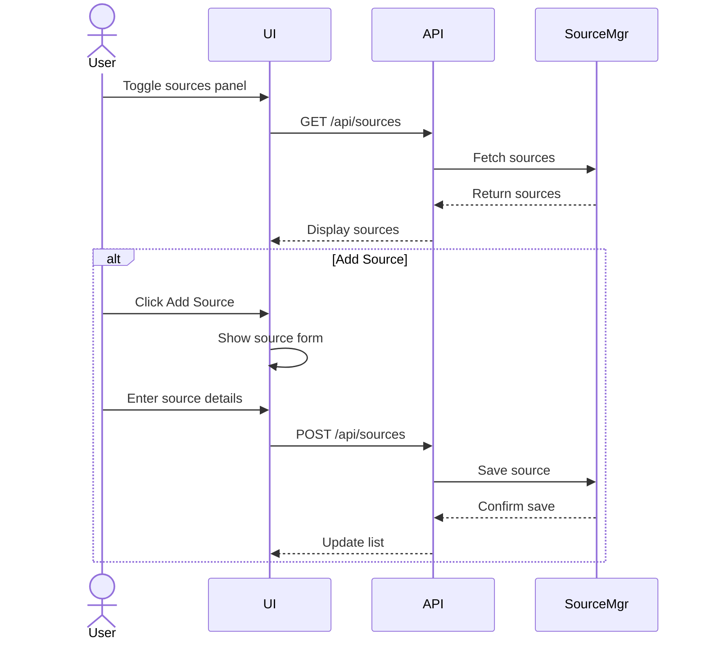
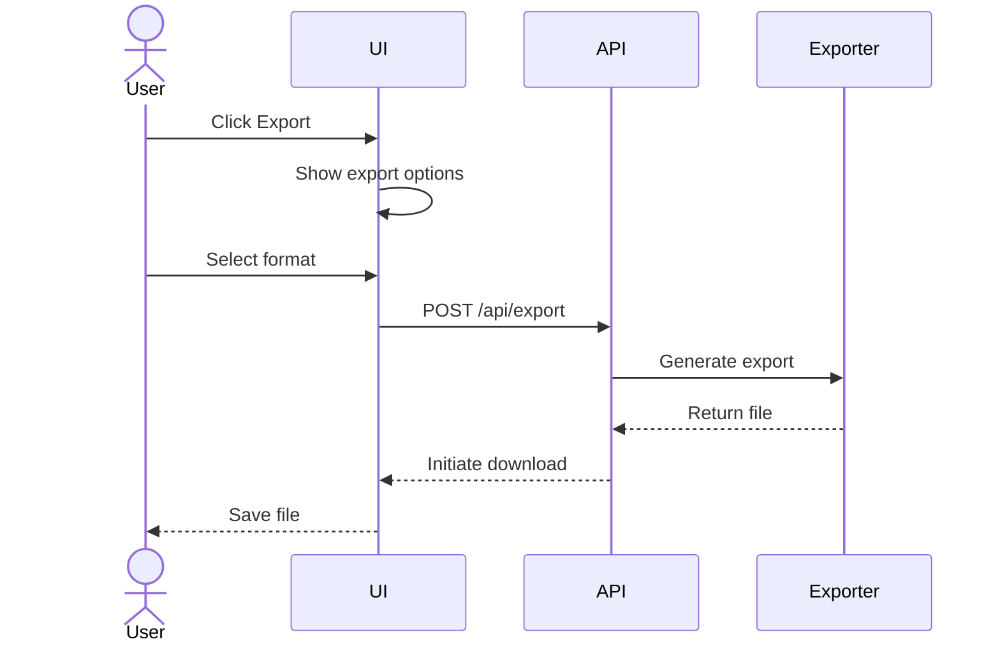

# Design Doc: Stock Analysis Application

## Requirements

1. **Core Analysis Features**
   - Value investing metrics and analysis
   - Technical analysis indicators
   - Competitor and market comparison
   - Historical performance analysis

2. **Interactive Features**
   - Adjustable visualizations and parameters
   - Report regeneration capabilities
   - Notes and annotations
   - Source management and toggling
   - Report management (listing, deletion, batch operations)
   - User preferences and settings

3. **Technical Requirements**
   - RAG system for market research
   - PDF export functionality
   - Input validation and sanitization
   - Error handling and recovery
   - Rate limiting for API calls
   - Cache management for performance
   - Secure data handling

## Flow Design



## Node Design

### Data Collection Nodes

1. **InputValidatorNode**
   - `type`: Regular
   - `prep`: Read ticker and parameters from shared store
   - `exec`: Validate inputs using the input_validator utility
   - `post`: Write validated data to shared["validated_input"]

2. **StockDataFetcherNode**
   - `type`: Regular
   - `prep`: Read validated ticker from shared["validated_input"]
   - `exec`: Call fetch_stock_data utility with rate limiting
   - `post`: Write results to shared["stock_data"]

3. **CacheManagerNode**
   - `type`: Regular
   - `prep`: Read data request info from shared["request_info"]
   - `exec`: Check if data exists in cache via cache_manager utility
   - `post`: If cache hit, write to shared["cached_data"]; return "cache_hit" or "cache_miss"

4. **MarketDataNode**
   - `type`: Regular
   - `prep`: Read ticker and sector from shared["stock_data"]
   - `exec`: Call fetch_market_data utility
   - `post`: Write competitor data to shared["market_data"]

### Analysis Nodes

5. **ValueMetricsNode**
   - `type`: Regular
   - `prep`: Read financial data from shared["stock_data"]
   - `exec`: Call value_metrics utility
   - `post`: Write metrics to shared["value_analysis"]

6. **TechnicalIndicatorsNode**
   - `type`: Regular
   - `prep`: Read price data from shared["stock_data"]
   - `exec`: Call technical_indicators utility
   - `post`: Write indicators to shared["technical_analysis"]

7. **MarketComparisonNode**
   - `type`: Regular
   - `prep`: Read shared["stock_data"] and shared["market_data"]
   - `exec`: Compare stock against sector/competitors
   - `post`: Write comparison results to shared["comparison_analysis"]

8. **RAGResearchNode**
   - `type`: BatchNode
   - `prep`: Return research questions based on stock and analysis
   - `exec`: For each question, query vector database using qdrant_client
   - `post`: Aggregate results to shared["research_data"]

### Visualization Nodes

9. **ChartGeneratorNode**
   - `type`: BatchNode
   - `prep`: Return list of required charts based on analyses
   - `exec`: For each chart, call chart_generator utility
   - `post`: Write generated charts to shared["visualizations"]

10. **UserPreferencesNode**
    - `type`: Regular
    - `prep`: Read user ID from shared["user_info"]
    - `exec`: Call preferences_manager utility
    - `post`: Write preferences to shared["user_preferences"]

### Report Management Nodes

11. **ReportCompilerNode**
    - `type`: Regular
    - `prep`: Read all analysis data and visualizations
    - `exec`: Compile complete report
    - `post`: Write to shared["report"] and shared["report_metadata"]

12. **PDFExportNode**
    - `type`: Regular
    - `prep`: Read report data from shared["report"]
    - `exec`: Call pdf_generator utility
    - `post`: Write file data to shared["pdf_export"]

13. **ReportManagementNode**
    - `type`: Regular
    - `prep`: Read operation type and parameters
    - `exec`: Call report_manager utility with appropriate operation
    - `post`: Write results to shared["operation_result"]

### Error Handling Nodes

14. **ErrorHandlerNode**
    - `type`: Regular
    - `prep`: Read error info from shared["error_data"]
    - `exec`: Format error using error_handler utility
    - `post`: Write formatted error to shared["error_response"]
    - This node has `max_retries=0` as it shouldn't retry error handling

## Shared Store Design

The shared store is a central in-memory dictionary that all nodes can access to read input and write output. This provides a clean separation between data storage and processing logic.

```python
shared = {
    # Input and Validation
    "user_info": {"id": "user123", "preferences": {}},
    "request_info": {"ticker": "AAPL", "params": {}},
    "validated_input": {},
    
    # Raw Data
    "stock_data": {},
    "market_data": {},
    "cached_data": {},
    
    # Analysis Results
    "value_analysis": {},
    "technical_analysis": {},
    "comparison_analysis": {},
    "research_data": {},
    
    # Visualization
    "visualizations": {},
    "user_preferences": {},
    
    # Report
    "report": {},
    "report_metadata": {},
    "pdf_export": {},
    
    # Operations
    "operation_result": {},
    
    # Errors
    "error_data": {},
    "error_response": {}
}
```

This shared store design organizes data by functionality and provides clear sections for input, raw data, analysis results, visualization, report data, operation results, and error handling. Each node knows which sections to read from and write to, ensuring clean data flow throughout the application.

## Utility Functions

1. **Data Collection Utils**
   - `fetch_stock_data.py`
     - *Input*: ticker (str)
     - *Output*: dict of price and financial data
     - Used by StockDataNode for data retrieval

   - `fetch_market_data.py`
     - *Input*: ticker (str), sector (str)
     - *Output*: dict of competitor and market data
     - Used by MarketDataNode for comparison data

2. **Analysis Utils**
   - `value_metrics.py`
     - *Input*: financial_data (dict)
     - *Output*: dict of Graham metrics
     - Used by ValueAnalysisNode

   - `technical_indicators.py`
     - *Input*: price_data (DataFrame)
     - *Output*: dict of technical indicators
     - Used by TechnicalAnalysisNode

3. **RAG Utils**
   - `document_processor.py`
     - *Input*: document (str)
     - *Output*: chunks (list)
     - Used by RAGNode for document processing

   - `qdrant_client.py`
     - *Input*: embeddings (list)
     - *Output*: stored_ids (list)
     - Used by RAGNode for vector storage

4. **Visualization Utils**
   - `chart_generator.py`
     - *Input*: data (dict), chart_type (str)
     - *Output*: plotly_figure (dict)
     - Used by VisualizationNode

   - `pdf_generator.py`
     - *Input*: report_data (dict)
     - *Output*: pdf_bytes (bytes)
     - Used by ReportCompilerNode

5. **Data Validation and Sanitization**
   - `input_validator.py`
     - *Input*: user inputs (ticker, parameters, etc.)
     - *Output*: validated and sanitized data
     - Used by API endpoints for input validation
     - Implements validation rules from PRD section 7.6

6. **Cache Management**
   - `cache_manager.py`
     - *Input*: data to cache, cache key
     - *Output*: cached data or cache status
     - Used for caching API responses and chart data
     - Implements caching rules from PRD section 15.1

7. **User Preferences**
   - `preferences_manager.py`
     - *Input*: user preferences (chart settings, etc.)
     - *Output*: stored/retrieved preferences
     - Used for persisting user settings
     - Handles chart preferences, source toggles, and view options

8. **Error Handling and Logging**
   - `error_handler.py`
     - *Input*: error details, context
     - *Output*: formatted error response
     - Used for consistent error handling across the app
     - Implements error handling from PRD section 7.4

9. **Data Transformation**
   - `data_transformer.py`
     - *Input*: raw data from various sources
     - *Output*: standardized data format
     - Used for normalizing data from different sources
     - Ensures consistent data structure across the application

10. **Rate Limiting**
    - `rate_limiter.py`
      - *Input*: API endpoint, request details
      - *Output*: allow/deny decision
      - Used to manage API request rates
      - Implements rate limits from PRD section 7.5

11. **Report Management**
    - `report_manager.py`
      - *Input*: Various operations (list, delete, create)
      - *Output*: Report data or operation status
      - Used for managing report lifecycle
      - Handles report metadata and storage
      - Implements report versioning and cleanup

Each utility function follows these principles:
- Single responsibility principle
- Clear input/output contracts
- Error handling and logging
- Unit test coverage
- Documentation with examples

Example implementation pattern:
```python
# example_utility.py

class ExampleUtility:
    def __init__(self, config: dict):
        self.config = config
        self.logger = error_handler.get_logger(__name__)

    async def process(self, input_data: dict) -> dict:
        try:
            # Input validation
            validated_data = input_validator.validate(
                input_data, 
                self.config["validation_rules"]
            )

            # Check cache
            cache_key = self._generate_cache_key(validated_data)
            cached_result = await cache_manager.get(cache_key)
            if cached_result:
                return cached_result

            # Check rate limits
            await rate_limiter.check_limit(
                "example_utility", 
                self.config["rate_limits"]
            )

            # Process data
            result = await self._process_data(validated_data)

            # Cache result
            await cache_manager.set(
                cache_key, 
                result, 
                ttl=self.config["cache_ttl"]
            )

            return result

        except Exception as e:
            self.logger.error(f"Error in ExampleUtility: {str(e)}")
            raise error_handler.format_error(e)

    def _generate_cache_key(self, data: dict) -> str:
        # Implementation
        pass

    async def _process_data(self, data: dict) -> dict:
        # Implementation
        pass

# Usage example
if __name__ == "__main__":
    config = {
        "validation_rules": {...},
        "rate_limits": {...},
        "cache_ttl": 3600
    }
    utility = ExampleUtility(config)
    result = await utility.process({"key": "value"})
```

## User Interaction Design

### Web Interface Layout

1. **Main Layout**
```
+----------------------------------+
|           Header Bar             |
|  [Ticker Input] [Generate]       |
+----------------------------------+
|          |                       |
| Nav      |    Report Content     |
| Sidebar  |    & Visualizations   |
|          |                       |
|          |                       |
+----------------------------------+
```

2. **Reports List Layout**
```
+----------------------------------+
| Reports                    [New] |
| [Search] [Filter] [Sort]        |
+----------------------------------+
| [ ] AAPL - Generated 2024-03-20 |
|     Status: Complete            |
|     [View] [Delete] [Regenerate]|
+----------------------------------+
| [ ] GOOGL - Generated 2024-03-19|
|     Status: Complete            |
|     [View] [Delete] [Regenerate]|
+----------------------------------+
| [ ] MSFT - In Progress          |
|     Status: Generating...       |
|     [View] [Cancel]             |
+----------------------------------+
| Showing 1-3 of 10               |
| [< Prev] [1] [2] [3] [Next >]   |
+----------------------------------+
```

3. **New Report Dialog**
```
+----------------------------------+
| Create New Report               |
+----------------------------------+
| Ticker: [     ]                 |
| 
| Analysis Options:               |
| [x] Value Analysis             |
| [x] Technical Analysis         |
| [x] Comparison Analysis        |
| [x] Recommendations           |
|                               |
| Time Range:                    |
| [ ] Default (1 year)          |
| [ ] Custom: [Start] to [End]   |
|                               |
| [Cancel]          [Generate]   |
+----------------------------------+
```

### User Interaction Flows

1. **Report Generation Flow**


2. **Report Management Flow**


3. **Chart Interaction Flow**


4. **Notes Management Flow**


5. **Source Management Flow**


6. **Export Flow**


### API Endpoints

```python
api_endpoints = {
    # Report Management
    "GET /api/reports": {
        "output": {
            "reports": [
                {
                    "id": str,
                    "ticker": str,
                    "generated_at": str,
                    "last_updated": str,
                    "sections": list,
                    "status": str
                }
            ],
            "pagination": {
                "page": int,
                "total_pages": int,
                "total_reports": int
            }
        }
    },
    "DELETE /api/reports/{id}": {
        "output": {"success": bool}
    },

    # Notes Management
    "POST /api/notes": {
        "input": {
            "report_id": str,
            "section": str,
            "content": str,
            "position": dict
        },
        "output": {"note_id": str}
    },
    "PUT /api/notes/{id}": {
        "input": {"content": str},
        "output": {"success": bool}
    },
    "GET /api/notes/{report_id}": {
        "output": {"notes": list}
    },

    # Source Management
    "GET /api/sources/{report_id}": {
        "output": {"sources": list}
    },
    "PUT /api/sources/toggle/{id}": {
        "input": {"enabled": bool},
        "output": {"affected_sections": list}
    },
    "POST /api/sources/add": {
        "input": {"url": str, "type": str},
        "output": {"source_id": str}
    },

    # Chart Interactions
    "PUT /api/charts/params": {
        "input": {
            "chart_id": str,
            "params": dict
        },
        "output": {"chart_data": dict}
    },

    # Export
    "POST /api/report/export": {
        "input": {
            "report_id": str,
            "format": str,  # pdf/html
            "sections": list
        },
        "output": {"download_url": str}
    }
}
```

### Interactive Features

1. **Report Generation**
   - User enters ticker symbol in the header bar
   - Optional parameters can be set via an advanced options panel
   - Progress indicator shows report generation status
   - Report automatically loads when ready

2. **Chart Interactions**
   - Zoom and pan controls on all charts
   - Toggle indicators on/off
   - Adjust time periods via dropdown
   - Hover tooltips for detailed data points
   - Save chart preferences per user

3. **Notes Management**
   - Click "Add Note" button in any section
   - Notes appear as icons in the margin
   - Click note icon to view/edit
   - Notes persist across report regenerations
   - Notes searchable via sidebar

4. **Source Management**
   - Collapsible sources panel shows all data sources
   - Toggle switches to enable/disable sources
   - Add custom sources via URL
   - Source changes trigger automatic regeneration of affected sections
   - Source reliability indicators

5. **Section Regeneration**
   - Each section has a "Regenerate" button
   - Progress indicator during regeneration
   - Option to modify parameters before regeneration
   - Historical versions accessible via sidebar

6. **Export Options**
   - Export full report or selected sections
   - Choose between PDF and interactive HTML
   - Include/exclude notes in export
   - Custom formatting options
   - Email delivery option

7. **Report Management**
   - Reports listing page showing all generated reports
   - Each report entry displays:
     - Ticker symbol
     - Generation date
     - Last update date
     - Report status
     - Available actions (view, delete, regenerate)
   - Sorting options:
     - By date (newest/oldest)
     - By ticker (A-Z)
     - By status
   - Filtering options:
     - By ticker
     - By date range
     - By status
   - Batch operations:
     - Delete multiple reports
     - Regenerate multiple reports
   - New report creation:
     - Quick create from ticker input
     - Advanced create with parameters
